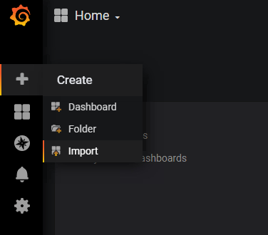

# Tarantool Grafana dashboard

## Requirements and setup

1. Install [go-jsonnet](https://github.com/google/go-jsonnet) compiler. We use v0.16.0. 

1. Install [jsonnet-bundler](https://github.com/jsonnet-bundler/jsonnet-bundler) package manager.

1. Install jsonnet package dependencies with ```jb install```.

## Experimental cluster

```docker-compose up -d``` will start 5 containers: Tarantool, Telegraf, InfluxDB, Prometheus and Grafana, which build cluster with two fully operational metrics datasources (InfluxDB and Prometheus), extracting metrics from Tarantool instance. We recommend using the exact versions we use in experimental cluster (e.g. Grafana v6.6.0). 

## Usage

Currently we provide only InfluxDB-based dashboard template. 

### InfluxDB dashboard

* Compile board template with
```bash
jsonnet -J ./vendor/ ./tarantool/dashboard.libsonnet -o ./output.json
```
to save json template into `output.json` file or
```bash
jsonnet -J ./vendor/ ./tarantool/dashboard.libsonnet | xclip -selection clipboard
```
to put json template into clipboard.

* Open Grafana import menu.



* Paste json template from clipboard or upload json template file.

* Set dashboard name, folder, uid (if needed), InfluxDB source and measurement of your project's metrics.


## Tests

You can run tests with `./tests.sh` script. `jsonnet` and `jsonnetfmt` must be added to terminal PATH variable.
